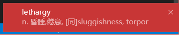
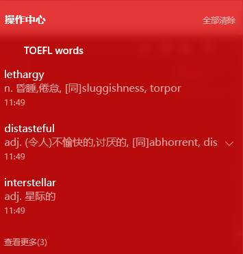

# TOEFL word random generator -Windows ver.

This program print a TOEFL word randomly from the word book "新东方·TOEFL词汇" by 王玉梅.

## Installation
First, [install the Go tools](https://golang.org/doc/install#install) and [install Mingw 64bit](https://sourceforge.net/projects/mingw-w64/), then add `bin` path to your `PATH` environment variable

Second, create a directory like `C:\Users\username\gocode` for following steps, add this directory to your `GOPATH`

After that, run the command below in your terminal
```
$ go get gopkg.in/iconv.v1
$ go get gopkg.in/toast.v1
$ go get github.com/Sunpeng1995/toefl
```
and find `toefl.exe` in a directory `bin` in which you have just created

## Usage
```
double click the executable file, or
$ toefl.exe
// show words every 5 minutes by default

$ toefl.exe 3 
// show words every 3 minutes by determined
```




I run this program all the time in background, which gives me a glimpse of the TOEFL words every few minutes. :smile: